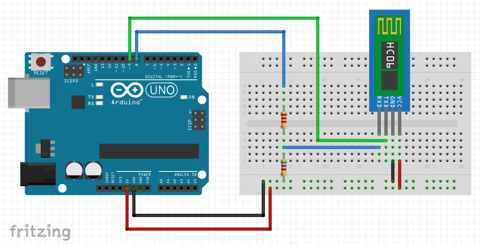
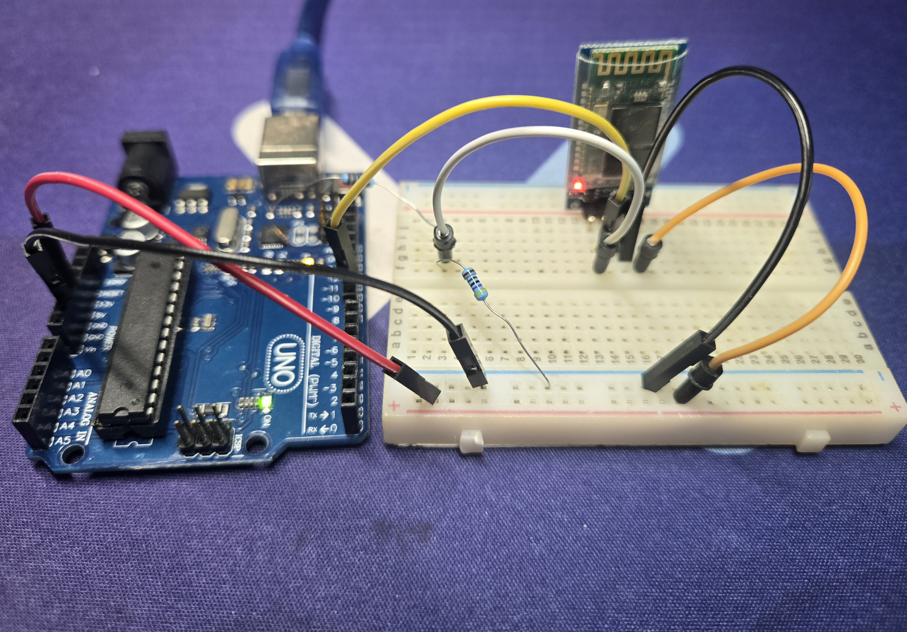

## Setup the HC-06 

## 회로 다이어그램 



## AT Command 

HC-06은 HC-05와 달리 **슬레이브(Slave) 모드로만 동작**하며, 페어링되지 않은 대기 상태에서 별도의 핀 조작 없이 자동으로 AT 명령어 모드에 진입합니다. 또한, 명령어 끝에 `\r\n`(엔터)과 같은 **종료 문자를 붙이지 않아도 되는 것**이 특징입니다.

### HC-06 AT 명령어 세트 요약

| 명령어 | 설명 | 응답 예시 | 비고 |
| :--- | :--- | :--- | :--- |
| **AT** | 통신 상태 테스트 | `OK` | 연결 확인용 |
| **AT+VERSION** | 펌웨어 버전 확인 | `LinvorV1.n` | 모듈의 소프트웨어 버전 정보 |
| **AT+NAME`<name>`** | 기기 이름 변경 | `OKname` | 최대 20자까지 설정 가능 |
| **AT+PIN`<xxxx>`** | 페어링 비밀번호 변경 | `OKsetpin` | 기본값은 `1234`이며 4자리 숫자 사용 |
| **AT+BAUD`<n>`** | 통신 속도(Baud rate) 설정 | `OK`<속도> | 1~C까지 설정 가능 (아래 참조) |
| **AT+PN** | 패리티 비트 사용 안 함 | `OK NONE` | 기본 설정값 (V1.5 이상 지원) |
| **AT+PO** | 홀수 패리티(Odd) 설정 | `OK ODD` | V1.5 이상 지원 |
| **AT+PE** | 짝수 패리티(Even) 설정 | `OK EVEN` | V1.5 이상 지원 |

---

### **보드 레이트 설정 값 (AT+BAUD`<n>`)**
*   **1**: 1200 / **2**: 2400 / **3**: 4800 / **4**: 9600 (기본값)
*   **5**: 19200 / **6**: 38400 / **7**: 57600 / **8**: 115200
*   **9**: 230400 / **A**: 460800 / **B**: 921600 / **C**: 1382400
*   *주의: 아두이노 Uno의 소프트웨어 시리얼은 보통 115200bps까지만 안정적으로 지원합니다.*

**참고사항:**
*   명령어 간의 간격은 약 **1초 정도**를 유지하는 것이 권장됩니다.
*   설정된 값(이름, 보드 레이트, 핀 등)은 모듈의 전원이 꺼져도 **내부 메모리에 저장**됩니다.

### 설정을 위한 코드 

```c
#include "Arduino.h"
#include <SoftwareSerial.h>

const byte rxPin = 9;
const byte txPin = 8;

SoftwareSerial BTSerial(rxPin, txPin); // RX TX

void setup() {
  // define pin modes for tx, rx:
  pinMode(rxPin, INPUT);
  pinMode(txPin, OUTPUT);
  BTSerial.begin(115200);
  Serial.begin(9600);
}

String messageBuffer = "";
String message = "";
char dataByte;

void loop() {
  while (BTSerial.available()) {
    dataByte = BTSerial.read();
    Serial.write(dataByte);
  }

  while(Serial.available()) {
    dataByte = Serial.read();
    BTSerial.write(dataByte);
  }
}

```

## Sample code 

```c
#include "Arduino.h"
#include <SoftwareSerial.h>

const byte rxPin = 9;
const byte txPin = 8;

SoftwareSerial BTSerial(rxPin, txPin); // RX TX

void setup() {
  // define pin modes for tx, rx:
  pinMode(rxPin, INPUT);
  pinMode(txPin, OUTPUT);
  BTSerial.begin(115200);
  Serial.begin(9600);
}

String messageBuffer = "";
String message = "";
char dataByte;

void loop() {
  while (BTSerial.available() > 0) {
    char data = (char) BTSerial.read();
    messageBuffer += data;
    if (data == ';') {
      message = messageBuffer;
      messageBuffer = "";
      Serial.print(message); // send to serial monitor
      message = "You sent " + message;
      BTSerial.print(message); // send back to bluetooth terminal
    }
  }
}
```

## Test Photo
